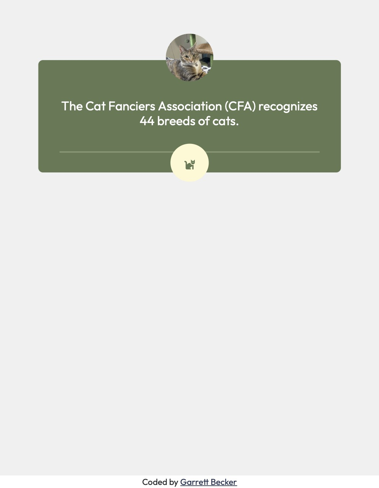
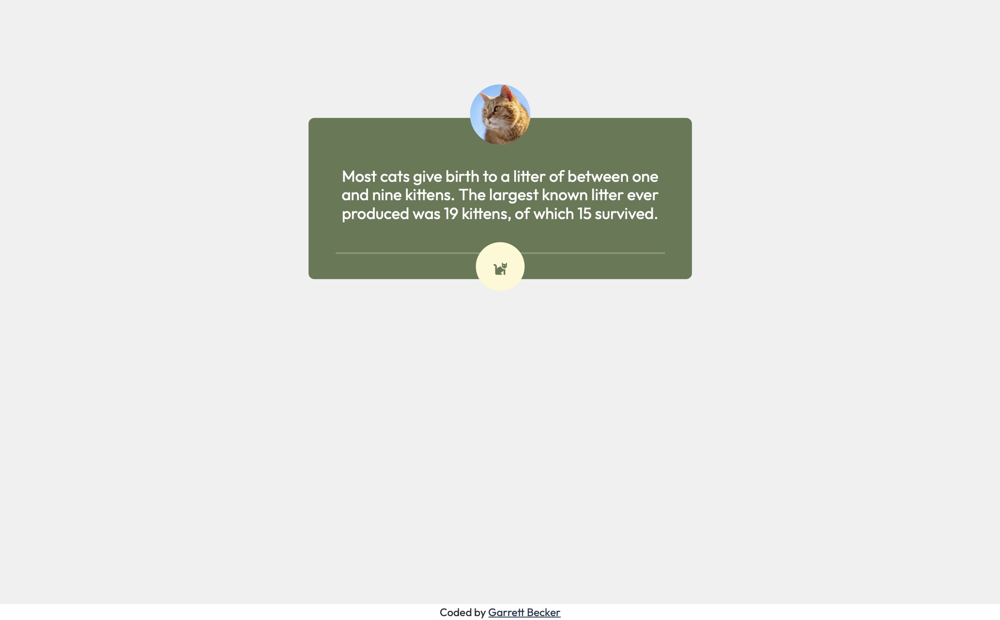

# Cat Facts Next.js App

When I was looking for free APIs to play around with, I'm so glad I stumbled across this cat facts API - just last year my family decided to adopt a kitten (crazy that this is our first family pet and we're all in our twenties!) and I've never thought I'd love cats as much as I do now, so I knew I wanted to make something with this API. I thought this would be a fun way to continue getting more familiar with Next.js, Bootstrap, and SASS together by adding in the main "get" call to grab a random cat fact, as well as add in a small back-end API call of my own to choose a random image for the top of the card (cat-6.jpg is our cat Poppie). I kept the design simple so I could focus more on the back-end functionality and I'm really happy with how this came out!

## Table of contents

- [Overview](#overview)
  - [Mobile View](#mobile-view)
  - [Desktop View](#desktop-view)
  - [Links](#links)
- [My process](#my-process)
  - [Built with](#built-with)
  - [What I learned](#what-i-learned)
  - [Continued development](#continued-development)
  - [Useful resources](#useful-resources)
- [Author](#author)

## Overview


### Mobile View



### Desktop View



### Links

- [Live Site URL](https://cat-facts-gdbecker.netlify.app/)

## My process

### Built with

- [React](https://reactjs.org/) - JS library
- [Next.js](https://nextjs.org) - React framework
- HTML5
- CSS
- [SASS](https://sass-lang.com) - CSS extension language
- Bootstrap
- Mobile-first workflow
- [VS Code](https://code.visualstudio.com)

### What I learned

For a simple concept I was surprised by the challenges that came up, but I'm thankful for them as they pushed me to persevere and keep going. Getting the design like I wanted felt great, especially the absolute positioning of the top cat image and bottom button. The trickiest part was figuring out the api route for the cat images. My goal was to pick a random pic from the six files I had loaded to pair with the random fact pulled from the public api. However once I figured out the right file path to use and got those loaded in a json file, I noticed that on deployment to Netlify or Vercel, none of the cat images were loading, even though the main public api call worked fine. 

This was challenging for me to figure out because although what I built worked on my Mac dev environment, I needed to think about the best way to make this work upon deployment. I kept pushing myself to figure it out, explored tutorials of using a hook called 'useSWR' and rewrote my custom api route multiple times. In the end I came up with a solution I'm proud of: my cat images api route scans through what cat pics I have in the public folder (instead of updating a json data file) and the key was to use "path.resolve" when finding those images. Then I was able to keep my "await fetch" function to use with NextResponse in my api route, so ultimately this app works as I wanted! Click the button and get back a random cat fact from the public api and a random cat pic from my loaded images.

Here are a few code samples from this project:

```html
<div className="row mt-1 g-1">
  <button className="cat-btn" type="button" title="Get new cat fact!" onClick={e => onClick(e)}><FaCat></FaCat></button>
</div>
```

```css
.cat-btn {
  background-color: $yellow;
  border: 0 !important;
  border-radius: 50%;
  bottom: -14px;
  box-shadow: none;
  color: $darkGreen;
  height: 8vh !important;
  left: 0px;
  margin: auto;
  outline: none !important;
  position: absolute;
  right: 0px;
  text-align: center;
  width: 8vh !important;
}

.cat-btn:hover {
  background-color: $green;
  color: $yellow;
}
```

```js
// API route for grabbing all cat images I have
export async function GET(request) {
  // Subfolder that contains the cat images to randomly pick from
  const dirRelativeToPublicFolder = 'cat-img'

  // Resolve the file path to look through - public is the parent, then the subfolder
  const dir = path.resolve('./public', dirRelativeToPublicFolder);

  // Read cat pics file names
  const filenames = fs.readdirSync(dir);

  // Create list of cat pics file names
  const images = filenames.map(name => path.join('/', dirRelativeToPublicFolder, name))

  // Return the list of images
  return NextResponse.json(images);
}
```

```js
// Function for grabbing new data
const fetchNewData = async () => {
  const responseFact = await fetch(
    'https://catfact.ninja/fact', {
      headers: {
        "Content-Type": "application/json",
        "Accept": "application/json"
      }
    }
  );  

  const dataFact = await responseFact.json();
  const responseImage = await fetch('/api/');
  const dataImage = await responseImage.json();

  setCatData({
    fact: dataFact.fact,
    image: dataImage
  });

  setLoading(false)
}
```

### Continued development

As a starter developer, I want to keep growing in working as a team and learning how to deliver smaller packages of code at a time, such as components like this one. I thought this project was a good way to get back into React and begin doing just that!

### Useful resources

- [CSS Formatter](http://www.lonniebest.com/FormatCSS/) - I found this helpful site when I'm feeling lazy and don't want to format my CSS code, I can have this do it for me, especially putting everything in alphabetical order.
- [Color Hunt](https://colorhunt.co) - I love using this site to pick from color palette's professional designers put together. It helps me quickly choose a color scheme I think would work best and focus more time on building.

## Author

- Website - [Garrett Becker]()
- Frontend Mentor - [@gdbecker](https://www.frontendmentor.io/profile/gdbecker)
- LinkedIn - [Garrett Becker](https://www.linkedin.com/in/garrett-becker-923b4a106/)
